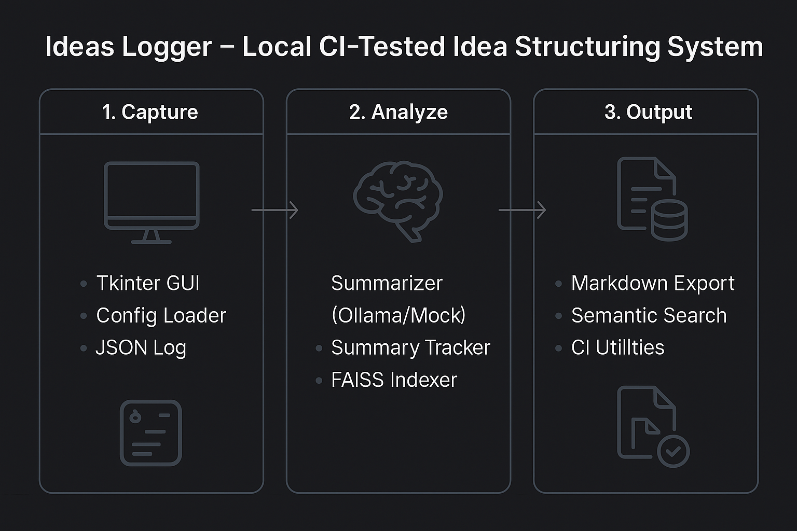
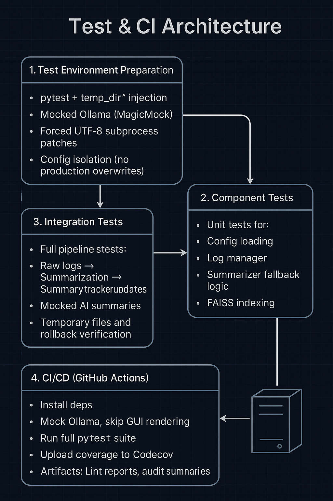

# 🚀 Ideas Logger — Structured Thought, Tested in Fire

[](https://codecov.io/gh/angelosdimakos/Ideas_Logger)
[](LICENSE)

> `python` • `tkinter` • `ollama` • `faiss` • `gui-app` • `llm` • `summarization` • `productivity`

---

> **Think. Structure. Summarize. Search. Build.**  
> Ideas Logger transforms unstructured thought into resilient, searchable knowledge — powered by local LLMs, semantic vector search, and full-stack CI pipelines.  
> **No external dependencies. No cloud lock-in. No excuses.**

---

## 🌐 Platform Overview

Ideas Logger is a professional-grade, local-first **thought management platform**.

It integrates:

- 🧠 **Local LLM summarization** (Ollama + fallback mocks)
- 🔎 **Semantic FAISS vector search** across structured logs
- 🖥️ **Tkinter GUI and CLI dual interfaces**
- 🛡️ **Full-stack CI testing** with artifact tracking and diff-based audits
- ⚙️ **Plugin-ready architecture** for future extensions (LangChain, mind-maps, Gantt charts)

All pipelines are tested, audited, and hardened for real-world deployment across fresh environments.

---
## 🏗️ System Overview

### Production Workflow


### Test & CI Workflow


---

## ⚙️ Core Features

| Category | Feature |
|:---------|:--------|
| 🧠 Intelligent Logging | Summarization by local LLM (Ollama) with customizable prompts |
| 🔍 Semantic Search | Instant FAISS-backed vector retrieval for ideas and summaries |
| 📦 Structured Persistence | Autosaved JSON logs, batch markdown exports, resilient backups |
| 🖥️ GUI + CLI Access | Tkinter-based GUI with headless-tested CI; CLI tools for scripted workflows |
| 🧪 End-to-End CI | Full test coverage including GUI bootstrapping, AI workflows, semantic indexing |
| 🔒 Isolation and Safety | Mocked AI backends, tempdir handling, strict config isolation in tests |

---

## 🏧 Architecture Snapshot

```bash
scripts/
├— core/          # Logging and summarization engines
├— ai/            # Local LLM integration and fallback handling
├— gui/           # Tkinter GUI, style management, widget factories
├— config/        # Dynamic configuration management (with test-mode override)
├— indexers/      # FAISS semantic indexing (summaries and raw logs)
├— ci_analyzer/   # CI audit and trend comparison pipelines
├— refactor/      # Code audit, complexity tracking, docstring enrichment
├— utils/         # File handling, Git integration, safety guards
tests/
├— unit/          # Component-level tests
├— integration/   # Workflow integration tests
├— mocks/         # LLM and filesystem mocks
```

---

## 🧪 Resilient Testing and Auditing

Ideas Logger enforces **production-grade standards**:

- ✅ Full mocking of AI dependencies (`ollama.generate`, `ollama.chat`)
- ✅ Tkinter GUI headless-patching for CI pipelines
- ✅ Persistent artifacts (linting, audit reports, docstring summaries)
- ✅ Diff-based audits for code changes (`RefactorGuard + CI Analyzer`)
- ✅ UTF-8 subprocess isolation to eliminate platform encoding drift
- ✅ `xvfb` headless GUI tests (optionally runnable locally)

> _Result: The entire stack — from AI summarization to semantic search to GUI initialization — can be verified without any real API dependency._

---

## 🯩 Designed for Extensibility

Ideas Logger is **modular** by design:

- 🔌 Add new plugins (LangChain agents, visual mind maps)
- 🧠 Extend LLM workflows with specialized prompts or fallback models
- 📂 Customize configuration schemas to fit new logging paradigms
- 📊 Visualize trends with CI trend analyzers over time

No rewrites. No hard coupling.  
All extensions follow the core test-mock-verify philosophy.

---

## 🚀 Quickstart

```bash
git clone https://github.com/angelosdimakos/Ideas_Logger.git
cd Ideas_Logger
pip install -r requirements.txt
python scripts/main.py
```

> ⚠️ Ensure [Ollama](https://ollama.com/) is installed and a model (e.g., `mistral`) is running:
> ```bash
> ollama run mistral
> ```

---

## 🌍 Roadmap Highlights

- [x] LLM summarization with local fallback
- [x] Semantic indexing across logs and summaries
- [x] Fully audited CI workflows with trend tracking
- [ ] Gantt view for timeline-based thinking
- [ ] Interactive mind map visualizer
- [ ] Plugin framework for intelligent augmentation

---

## 🔒 License

Licensed under the [MIT License](LICENSE).

Use it. Fork it. Build on it.  
Attribution encouraged but not required.

---

## 🧙‍♂️ Closing Note

> **Ideas Logger is not just a note-taking app.**  
> It is a **resilient thought infrastructure**, built for those who demand control over their own ideas.  
> **Structured thought. Resilient engineering. No compromises.**