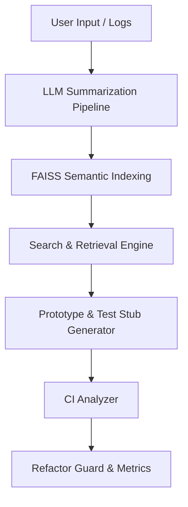
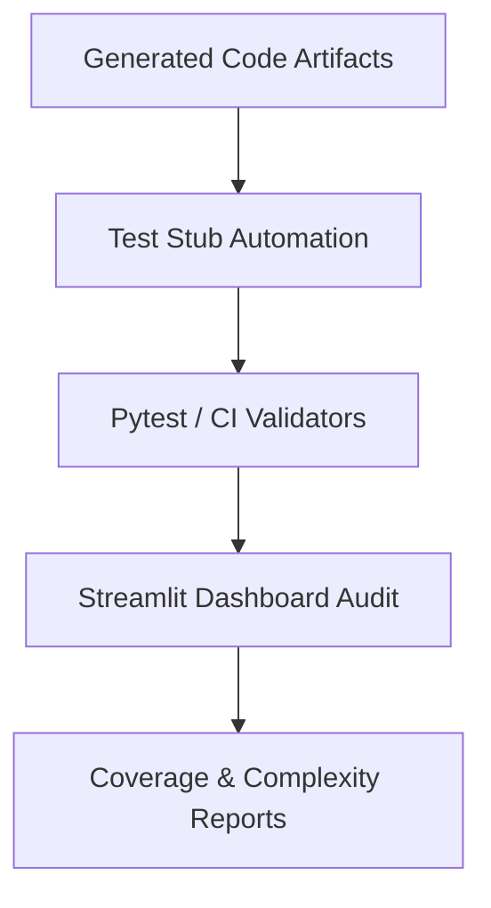

# 🚀 Ideas Logger — From Thought to Engineering Artifact

[](https://codecov.io/gh/angelosdimakos/Ideas_Logger)
[](LICENSE)
[]()

> `python` • `ollama` • `faiss` • `streamlit` • `llm` • `semantic_search` • `ci_cd` • `knowledge_graph` • `refactoring_toolkit`

---

> **Engineer Thought. Automate Refactoring. Visualize Knowledge.**
> Ideas Logger is a production-hardened, AI-augmented code and idea management ecosystem.
> **No cloud lock-in. Fully local-first. Extreme engineering discipline enforced.**

---

## 🌐 Platform Capabilities

Ideas Logger is an intelligent, modular platform for managing ideas, analyzing codebases, and automating refactoring workflows.

It integrates:

* 🤖 **Local LLM-Driven Summarization** (Ollama w/ fallback mechanisms)
* 🔍 **FAISS-Powered Semantic Search** for raw logs and summaries
* 📚 **Knowledge Graph Generation** from codebase relationships and docstrings
* 🛠️ **Automated Prototype & Test Stub Generation** (Production-Scaffold Ready)
* 📈 **Full CI Analyzer & Refactor Guard** with quality trend monitoring
* 🖥️ **Streamlit Dashboards & Tkinter GUI** for visual exploration
* 🔌 **Plugin-Ready Architecture** for mind maps, cognitive load diagrams, and trend visualizations

> *From a single thought to a validated engineering artifact — Ideas Logger connects the dots.*

---

## 🏗️ System Architecture

### 🚧 Production Pipeline



### 🔬 Test & CI Workflow



---

## ⚙️ Feature Highlights

| Category                 | Feature Description                                              |
| ------------------------ | ---------------------------------------------------------------- |
| 🤖 AI Summarization      | LLM-powered entry and bulk summaries (Ollama + fallback)         |
| 🔍 Semantic Search       | FAISS top-k vector retrieval for raw logs and summaries          |
| 📚 Knowledge Graph       | Codebase graph visualization with cyclomatic complexity overlays |
| 🛠️ Prototype Automation | Production-level scaffold generation + pytest stubs              |
| 📈 CI Analyzer           | Severity audits, complexity metrics, and trend reporting         |
| 🖥️ Multi-Interface      | Tkinter GUI, CLI Tools, Streamlit Dashboards                     |
| 🔒 Security              | Mocked AI backends, isolated test configs, subprocess isolation  |

---

## 📦 Project Structure

```plaintext
scripts/
├── core/            # Centralized Logging & Summarization Engines
├── ai/              # LLM Integration, Prompt Management, Fallbacks
├── gui/             # Tkinter GUI + Streamlit Dashboards
├── config/          # Dynamic Config Manager (with Test Mode Override)
├── indexers/        # FAISS Semantic Indexing Modules
├── ci_analyzer/     # CI Audit & Trend Visualization Tools
├── refactor/        # Complexity Analysis, Refactoring Toolkit, Quality Audits
├── kg/              # Knowledge Graph Construction & Visualization
tests/
├── unit/            # Component-Level Unit Tests
├── integration/     # End-to-End Workflow Tests
├── mocks/           # LLM & Filesystem Mocks for CI Pipelines
```

---

## 🧪 Engineering Discipline

* ✅ Full Mocking of AI Dependencies (`ollama.generate`, `ollama.chat`)
* ✅ Tkinter GUI Headless Testing via `xvfb` in CI Pipelines
* ✅ Persistent JSON Artifacts: Lint Reports, Doc Summaries, Complexity Metrics
* ✅ Diff-Based Audits with RefactorGuard + CI Analyzer
* ✅ Prototype and Test Stub Auto-Generation Enforced via Code Quality Metrics
* ✅ UTF-8 Subprocess Isolation to Eliminate Platform Drift

> *Result: Zero hidden dependencies. Fully portable. Fully testable. Verified at every stage.*

---

## 🔌 Extension Ready

* 📊 Add Custom Plugins (LangChain Agents, Graph Visualizers, Mind Maps)
* 📂 Extend Config Schemas for New Logging Paradigms
* 🧠 Introduce Advanced LLM Prompt Personas for Specialized Summarization
* 📅 Future-Proof with Gantt Chart Integration and Cognitive Load Visualizers

---

## 🚀 Quickstart

```bash
git clone https://github.com/angelosdimakos/Ideas_Logger.git
cd Ideas_Logger
pip install -r requirements.txt
python scripts/main.py
```

> ⚠️ Ensure [Ollama](https://ollama.com/) is installed and a model (e.g., `mistral`) is running:
>
> ```bash
> ollama run mistral
> ```

---

## 🌍 Roadmap

* [x] AI Summarization with Local Fallbacks
* [x] Semantic Indexing for Raw Logs and Summaries
* [x] Knowledge Graph Generation from Codebase Structures
* [x] Full CI Audit with Trend Visualization Dashboards
* [x] Prototype + Test Stub Auto-Generation (Production-Scaffold Ready)
* [ ] Gantt Timeline View for Process Visualization
* [ ] Interactive Mind Map with Drag-and-Drop Thought Structuring
* [ ] Plugin Marketplace for Community Extensions

---

## 🔒 License

Licensed under the [APACHE License](LICENSE).
Build freely. Attribute respectfully.

---

## 🧙‍♂️ Final Word

> **Ideas Logger is not a note-taking app.**
> It’s a fully autonomous **Knowledge Engineering System**.
> Built for engineers, researchers, and visionaries who demand control, clarity, and uncompromising technical rigor over their thinking processes.

> **Structured Thought. Resilient Engineering. No Compromises.**
